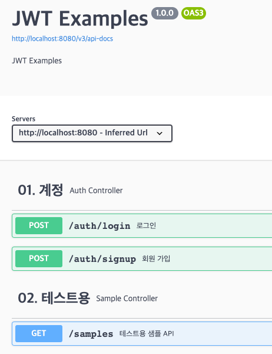

# 🔐 spring-boot-security-jwt-auth-examples
**Spring Security & JWT와 친해지기**



- Spring Boot `2.5.6`
- Spring Security
- Spring Data JPA
- Java 11
- Gradle
- H2 Database

## 🤹 실행
```bash
# Clone this repo
git clone https://github.com/yj-oh/spring-boot-security-jwt-auth-examples.git

# Change directory
cd spring-boot-security-jwt-auth-examples

# Start the Server
./gradlew bootRun
```
- Port `8080`

## 🌐 접속 정보

#### H2 Database
- http://localhost:8080/h2-console

#### Swagger
- http://localhost:8080/swagger-ui/index.html

## 💁‍♀️ Endpoints
| Endpoint     | 설명                  |
|--------------|---------------------|
| /auth/signup | 회원 가입               |
| /auth/login  | 로그인                 |
| /samples     | 테스트용 샘플 API (인증 필요) |

- 정상적으로 로그인이 되었을 때 아래와 같은 형태의 응답값을 받아볼 수 있다.
```json
{
  "id": 1,
  "email": "test@test.com",
  "username": "마이크와조스키",
  "tokenType": "Bearer",
  "token": {JWT}
}
```

## 🗂 Structure
```text
🗂 spring-boot-security-jwt-auth-examples
|── 📂 src
|   `── 📂 main
|       |── 📂 java
|       |   `── com.yjworld.jwt
|       |       |── 📂 common                                   # 공통으로 쓰이는 파일들
|       |       |   |── 📋 CommonError.java                         # 예외 핸들링하기 위한 공통 모델
|       |       |   `── 📋 CustomExceptionHandler.java              # 예외 핸들링
|       |       |── 📂 config                                   # 설정 파일들
|       |       |   |── 📂 jwt
|       |       |   |   |── 📋 JwtAuthenticationEntryPoint.java     # 인증 실패 시 예외 핸들링
|       |       |   |   |── 📋 JwtAuthenticationFilter.java         # 인증 필터
|       |       |   |   `── 📋 JwtUtils.java                        # 토큰 생성, parsing, 검증 등의 메서드 모음
|       |       |   |── 📂 security
|       |       |   |   |── 📋 UserDetailsImpl.java                 # UserDetails 구현
|       |       |   |   `── 📋 UserDetailsServiceImpl.java          # UserDetailsService 구현
|       |       |   |── 📂 SecurityConfig.java                      # Security 설정
|       |       |   `── 📂 SwaggerConfig.java                       # Swagger 설정
|       |       |── 📂 domain
|       |       |   |── 📂 auth                                 # 인증 관련 API, 로직
|       |       |   |── 📂 common                               # API 레벨에서 공통으로 쓰이는 파일들
|       |       |   |   `── 📋 AuditCreatedAndUpdated.java          # 생성일시, 수정일시 공통 컬럼
|       |       |   |── 📂 sample                               # 테스트용 샘플 API
|       |       |   `── 📂 user                                 # User 관련 로직
|       |       `── 📋 SpringSecurityJwtApplication.java
|       `── 📂 resources
|           `── 📋 application.yml
`── 📋 build.gradle                                             # Gradle 설정 파일
```
